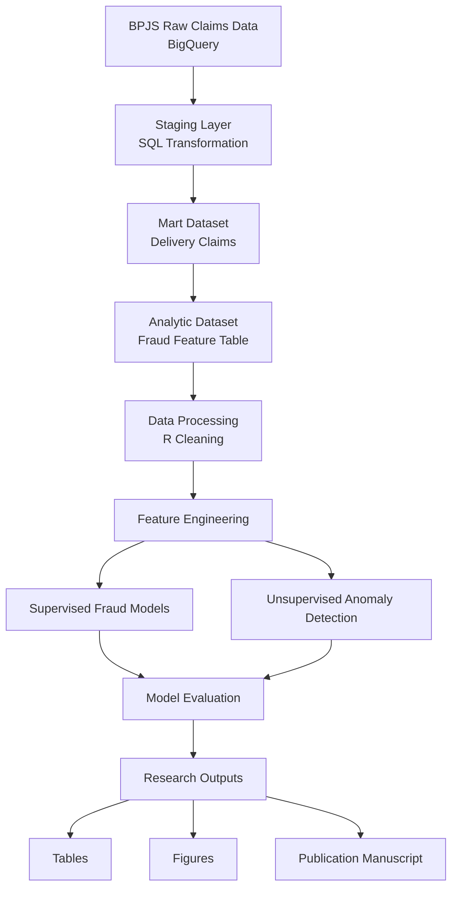

```mermaid
flowchart TB

A[BPJS Raw Claims Data<br>BigQuery] --> B[Staging Layer<br>SQL Transformation]

B --> C[Mart Dataset<br>Delivery Claims]

C --> D[Analytic Dataset<br>Fraud Feature Table]

D --> E[Data Processing<br>R Cleaning]

E --> F[Feature Engineering]

F --> G1[Supervised Fraud Models]
F --> G2[Unsupervised Anomaly Detection]

G1 --> H[Model Evaluation]
G2 --> H

H --> I[Research Outputs]

I --> J[Tables]
I --> K[Figures]
I --> L[Publication Manuscript]
```